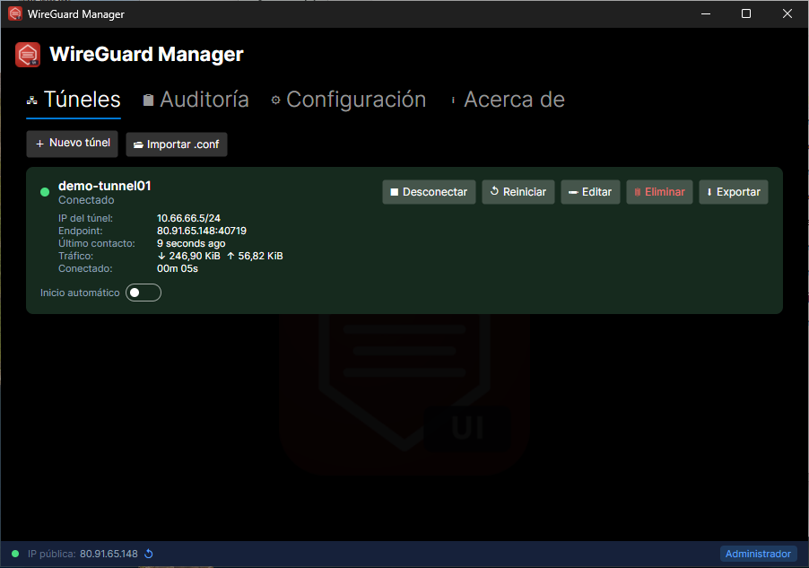
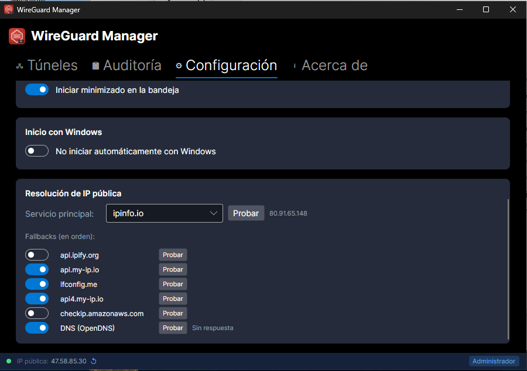
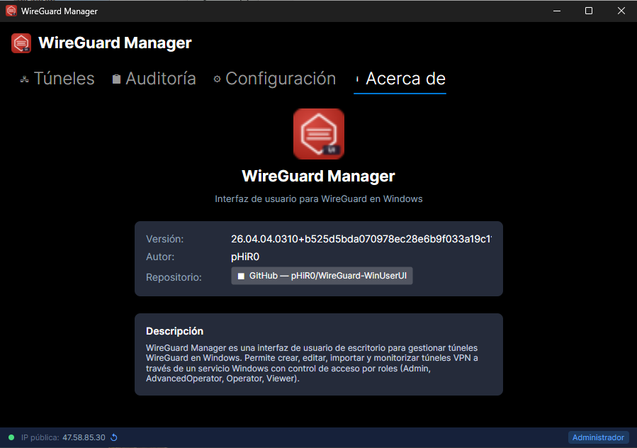

# WireGuard Manager — WinUserUI

> **Gestión de túneles WireGuard en Windows para usuarios sin privilegios de administrador.**

[](https://github.com/pHiR0/WireGuard-WinUserUI/actions/workflows/ci.yml)
[](https://dotnet.microsoft.com/download/dotnet/8)
[](https://www.microsoft.com/windows)
[](LICENSE)

---

## ¿Qué problema resuelve?

WireGuard para Windows permite que usuarios sin privilegios de administrador activen y desactiven túneles existentes, pero **únicamente eso**, y solo si un administrador les ha otorgado previamente el permiso de *Operador de red limitado* mediante el método `LimitedOperatorUI`. Operaciones como crear, importar, editar o eliminar túneles siguen requiriendo derechos de administrador completos.

**WireGuard Manager** amplía estas capacidades mediante una arquitectura de dos capas que no depende de `LimitedOperatorUI`:

- Un **servicio de Windows** que corre con privilegios de `LocalSystem` y gestiona los túneles.
- Una **aplicación de escritorio** sin privilegios que se comunica con el servicio a través de un Named Pipe local seguro.

El usuario puede ver, conectar, desconectar, crear, importar, editar y eliminar túneles **sin necesidad de UAC ni derechos de administrador**, con un sistema de roles granular gestionado por grupos de Windows. Toda la lógica privilegiada permanece aislada en el servicio.

---

## Capturas

| Túneles | Configuración | Acerca de |
|---------|---------------|-----------|
|  |  |  |

---

## Características

- **Lista de túneles** — estado en tiempo real (conectado/desconectado/pendiente/error)
- **Conectar / Desconectar / Reiniciar** túneles según el rol del usuario
- **Crear, importar y editar** configuraciones `.conf` de WireGuard (editor modal con validación)
- **Eliminar** túneles
- **Inicio automático por túnel** — configurable individualmente
- **Estadísticas de túnel** — IP local (CIDR), endpoint, último handshake, Rx/Tx, tiempo conectado
- **IP pública** — resolución con cadena de fallback (7 proveedores HTTP + DNS OpenDNS), configurable
- **Roles por grupos de Windows** — sin gestión de usuarios dentro de la app
- **Notificaciones Toast** de Windows al conectar/desconectar túneles
- **Tray icon** — minimización a bandeja, icono cambia según estado de túneles
- **Auditoría** — registro de todas las operaciones en `%ProgramData%\WireGuard-WinUserUI\audit.jsonl`
- **Interfaz en español**
- **Instalador MSI** con WiX v5

---

## Requisitos previos

| Requisito | Versión mínima |
|-----------|---------------|
| Windows | 10 (build 17763) / 11 |
| [WireGuard para Windows](https://www.wireguard.com/install/) | Última estable |
| .NET Runtime 8 *(solo si no usas el instalador self-contained)* | 8.0 |

> El instalador MSI incluye el runtime de .NET 8 embebido — no necesitas instalarlo por separado.

---

## Roles y permisos

Los permisos se gestionan a través de **grupos de Windows locales** que el servicio crea al arrancar:

| Grupo de Windows | Rol | Permisos |
|-----------------|-----|----------|
| `WireGuard UI - Visualizador` | Viewer | Ver túneles y estado |
| `WireGuard UI - Operador` | Operator | + Conectar/Desconectar |
| `WireGuard UI - Operador avanzado` | Advanced Operator | + Crear/Importar/Editar/Eliminar túneles |
| `WireGuard UI - Administrator` | Admin | Acceso completo |
| `BUILTIN\Administrators` | Admin | Acceso completo (automático) |

Para añadir un usuario a un rol, agrega su cuenta al grupo correspondiente mediante *Administración de equipos* (`compmgmt.msc`).

### Todos los usuarios como Operador por defecto

Existe una opción global que permite que **cualquier usuario autenticado** que no pertenezca a ningún grupo de roles sea tratado automáticamente como **Operador** (puede conectar/desconectar túneles).

- **Por defecto: desactivado.**
- Se activa desde la pestaña *Configuración* de la UI (visible solo para usuarios con rol Administrador).
- Es una **configuración global** que afecta a todos los equipos donde está instalado el servicio.
- Internamente se almacena en el registro de Windows:
  `HKLM\SOFTWARE\WireGuard-WinUserUI\AllUsersDefaultOperator` (DWORD: 0 = desactivado, 1 = activado)
- Los usuarios que tengan un rol explícito asignado (mediante grupo de Windows) conservan siempre su rol asignado, independientemente de esta opción.

---

## Instalación

### Opción A — Instalador MSI *(recomendado)*

1. Descarga el último `.msi` desde [GitHub Releases](https://github.com/pHiR0/WireGuard-WinUserUI/releases).
2. Ejecuta el instalador como **administrador**.
3. El servicio `WireGuard-WinUserUI` se instala y arranca automáticamente.
4. Abre **WireGuard Manager** desde el Menú Inicio o el Escritorio.

### Opción B — Compilar desde el código fuente

```powershell
# 1. Clonar el repositorio
git clone https://github.com/pHiR0/WireGuard-WinUserUI.git
cd WireGuard-WinUserUI

# 2. Restaurar dependencias
dotnet restore

# 3. Ejecutar en modo desarrollo (requiere WireGuard instalado)
dotnet run --project src/Service   # en una terminal (como Administrador)
dotnet run --project src/UI        # en otra terminal
```

---

## Generar el instalador MSI

```powershell
# Requisito previo (solo la primera vez)
dotnet tool install --global wix

# Generar MSI con versión automática (formato yy.MM.dd.HHmm)
.\scripts\package.ps1

# O especificando versión manualmente
.\scripts\package.ps1 -Version "26.04.04.1200"
```

El artefacto resultante queda en `artifacts/WireGuard-WinUserUI-<version>-x64.msi`.

---

## Estructura del proyecto

```
src/
  Shared/          # Contratos IPC, DTOs y enums compartidos
  Service/         # Servicio Windows privilegiado (.NET 8 Worker Service)
  UI/              # Aplicación de escritorio (Avalonia 11)
tests/
  Service.Tests/   # Tests del servicio (84 tests)
  UI.Tests/        # Tests de ViewModels (12 tests)
installer/         # Proyecto WiX v5 para el MSI
scripts/           # build.ps1, test.ps1, package.ps1
docs/              # Arquitectura, roadmap, decisiones, guidelines
```

---

## Stack tecnológico

| Capa | Tecnología |
|------|-----------|
| Lenguaje | C# 12 / .NET 8 |
| UI | [Avalonia 11](https://avaloniaui.net/) + MVVM (CommunityToolkit.Mvvm) |
| IPC | Named Pipes (local) con framing JSON length-prefix |
| Autorización | RBAC por grupos de Windows locales |
| Auditoría | JSON Lines (`audit.jsonl`) |
| Notificaciones | Windows Toast (Microsoft.Toolkit.Uwp.Notifications) |
| Instalador | [WiX Toolset v5](https://wixtoolset.org/) |
| Tests | xUnit |

---

## Seguridad

El canal IPC está protegido por múltiples capas:

- **ACL diferenciada**: DENY explícito a `NetworkSid` (bloqueo remoto), SYSTEM/Administrators FullControl, AuthenticatedUsers ReadWrite.
- **Anti-squatting**: `FILE_FLAG_FIRST_PIPE_INSTANCE` — si otro proceso ocupa el nombre del pipe, el servicio arranca en error.
- **Identificación por SID**: el servicio identifica a cada cliente por su SID de Windows (no solo por nombre de usuario).
- **Rate limiting**: máximo 4 conexiones concurrentes por SID.
- **Protección de `.conf`**: los archivos de configuración de WireGuard tienen ACL restringida (solo SYSTEM y Administrators).

Véase [docs/security.md](docs/security.md) para detalles completos.

---

## Sobre el proyecto

Este proyecto fue desarrollado mediante **vibe coding** — una metodología de desarrollo asistida por IA generativa donde el desarrollador guía la dirección, las decisiones de diseño y los requisitos, mientras la IA genera e itera el código bajo supervisión humana continua.

**Autor**: [pHiR0](https://github.com/pHiR0)  
**Repositorio**: [github.com/pHiR0/WireGuard-WinUserUI](https://github.com/pHiR0/WireGuard-WinUserUI)

---

## Licencia

Este software se distribuye bajo la **GNU General Public License v2.0 (GPLv2)**.

Puedes redistribuirlo y/o modificarlo bajo los términos de la GPLv2 publicada por la Free Software Foundation. Consulta el archivo [LICENSE](LICENSE) para más detalles.

```
WireGuard Manager
Copyright (C) 2026 pHiR0

Este programa es software libre: puede redistribuirlo y/o modificarlo
bajo los términos de la Licencia Pública General de GNU publicada por
la Free Software Foundation, ya sea la versión 2 de la Licencia, o
(a su elección) cualquier versión posterior.

Este programa se distribuye con la esperanza de que sea útil,
pero SIN NINGUNA GARANTÍA. Consulte la LICENSE para más detalles.
```

> **WireGuard®** es una marca registrada de Jason A. Donenfeld. Este proyecto no está afiliado con el proyecto WireGuard ni con sus desarrolladores.
